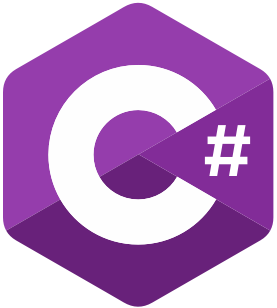

<h3 align="center"> Skills </h3>

  
  &nbsp;
  
  &nbsp;
  

<h4 align="left"> About me </h4>

 - :school: Computer Science Student at AGH University of Krakow & Rzeszów University of Technology
 - :computer: Software Engineer at Motorola Solutions Systems

 

<!-- 

  

 
-->

<!--
**QuSZo/QuSZo** is a ✨ _special_ ✨ repository because its `README.md` (this file) appears on your GitHub profile.

Here are some ideas to get you started:

- 🔭 I’m currently working on ...
- 🌱 I’m currently learning ...
- 👯 I’m looking to collaborate on ...
- 🤔 I’m looking for help with ...
- 💬 Ask me about ...
- 📫 How to reach me: ...
- 😄 Pronouns: ...
- ⚡ Fun fact: ...
-->
